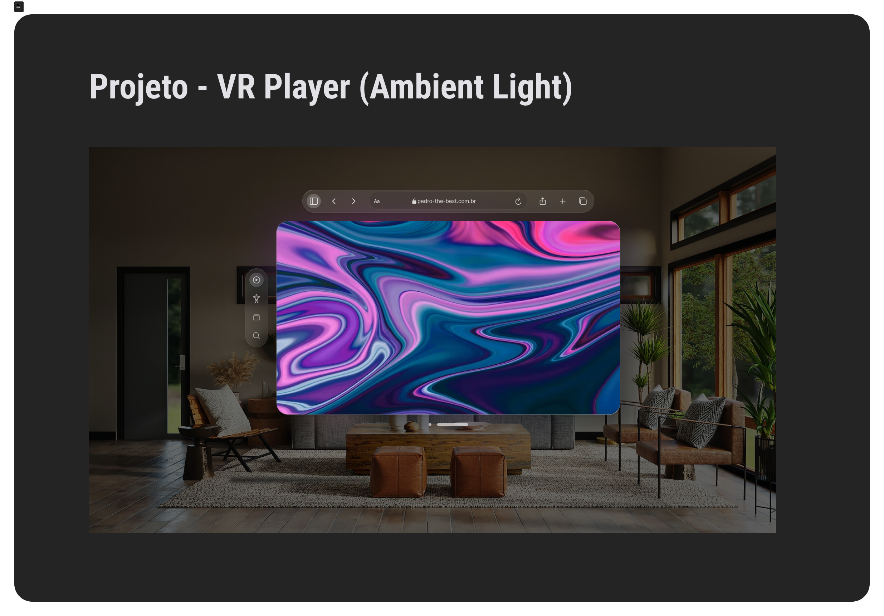

# 🎮 VR Player Video Ambient Light 🌟

## Descrição 📽️

O "VR Player Video Ambient Light" é um projeto que combina um player de vídeo do YouTube com iluminação ambiente. Ele oferece uma experiência de visualização imersiva, sincronizando a iluminação com o vídeo em tempo real.

## Captura de Tela 📸



## Recursos 🚀

- **Player de Vídeo do YouTube:** Assista a vídeos do YouTube diretamente no projeto.

- **Iluminação Ambiente:** Sincronize a iluminação com o vídeo para uma experiência imersiva.

## Como Usar 📦

Siga estas etapas para usar o "VR Player Video Ambient Light" em sua máquina:

1. Clone este repositório:

   ```bash
   git clone https://github.com/Pedrowesley/vr-player-ambient-light.git
   ```

2. Abra o arquivo `index.html` em seu navegador.

3. O player de vídeo será carregado e você poderá reproduzir vídeos do YouTube. A iluminação ambiente será sincronizada com o vídeo para uma experiência imersiva.

## Pré-requisitos ⚙️

- Navegador da web moderno.
- Conexão à internet.

## Contribuições 🤝

Se você deseja contribuir para este projeto, siga estas etapas:

1. Fork o repositório.
2. Crie uma nova branch: `git checkout -b minha-contribuição`
3. Faça as alterações desejadas e faça commit delas.
4. Envie suas alterações: `git push origin minha-contribuição`
5. Abra um Pull Request explicando suas alterações.

Certifique-se de seguir as diretrizes de contribuição do projeto.

## Contato 📧

- LinkedIn: [Pedro Wesley](https://www.linkedin.com/in/pedro-wesley-440130145/)
- Email: pedrodev101@gmail.com
